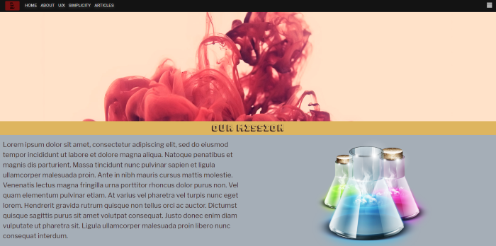
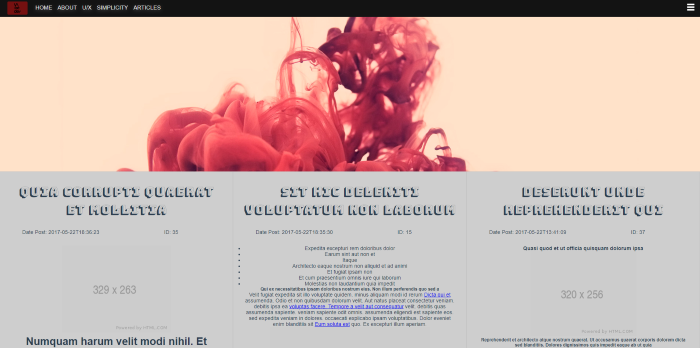
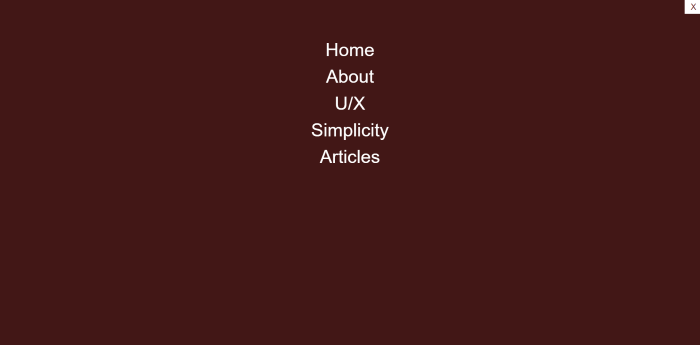
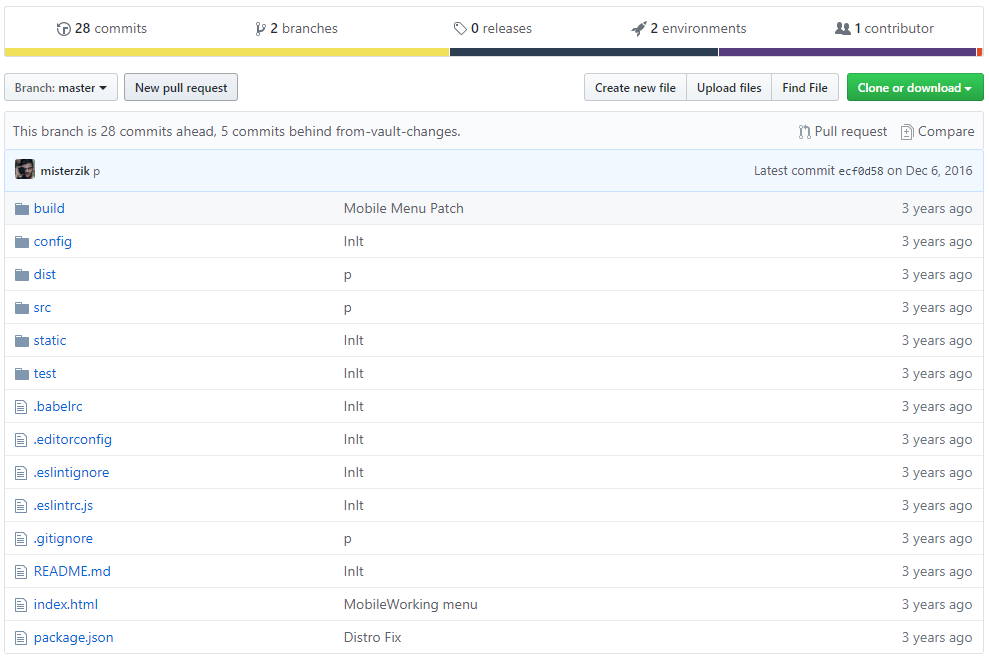

# VUEJS WPReceiver

 
---
 
---
 

### Behind the scenes

It's mid of 2016, Detaching Wordpress CMS or any CMS became more popular around this time, I started playing around many other framework, Specially AngularJS of my fav, but after hearing VUEjs owner left the Angular company, that for me was huge since i always look up to his work, and i decide to give vue a try, which at the moment i felt was doing a better job than React at the time. 

## Build Setup

``` bash
# install dependencies
npm install

# serve with hot reload at localhost:8080
npm run dev

# build for production with minification
npm run build

# run unit tests
npm run unit

# run e2e tests
npm run e2e

# run all tests
npm test
```

## Fake API

``` bash
npm run fake-rest
```


### Legacy Dependencies :

1) WordPress API (I set a mock version of API on repo.)
2) VUEJS


### History Snapshot:

so why snapshot's? in order to be able to make all this public, there is a lot of clean up to do specially with some of this old deprecated code and private tokens, so in order for me to do that i've to erase all commits for all our script kiddies out there.



